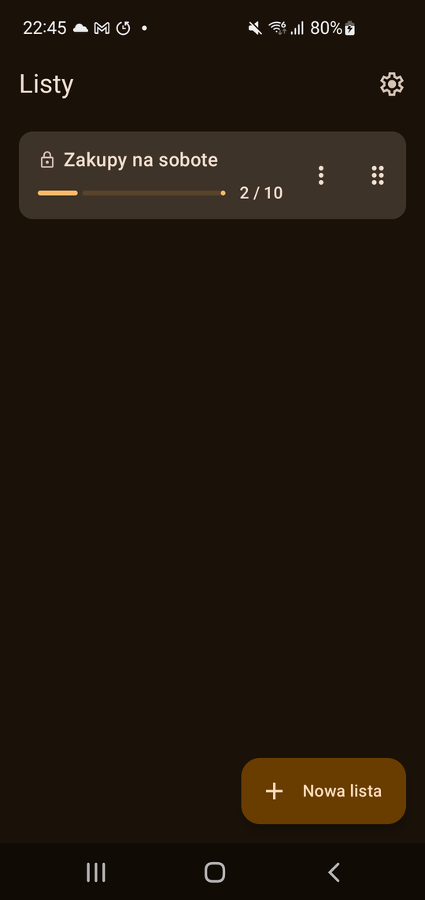
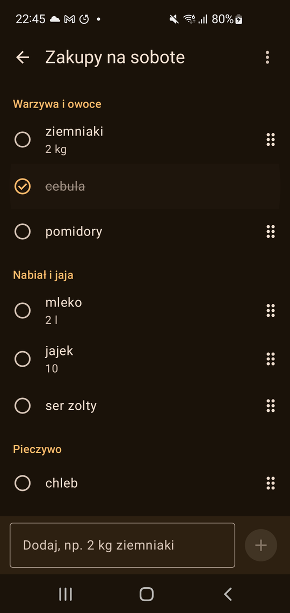
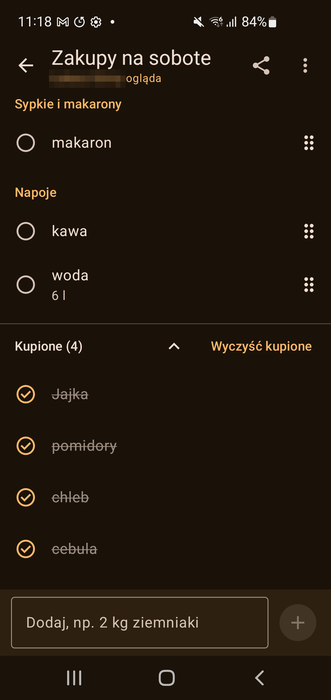
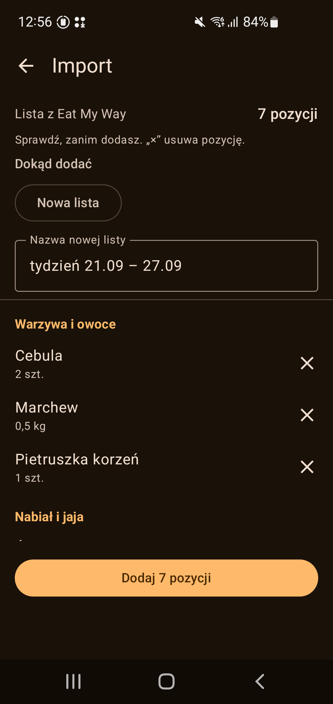
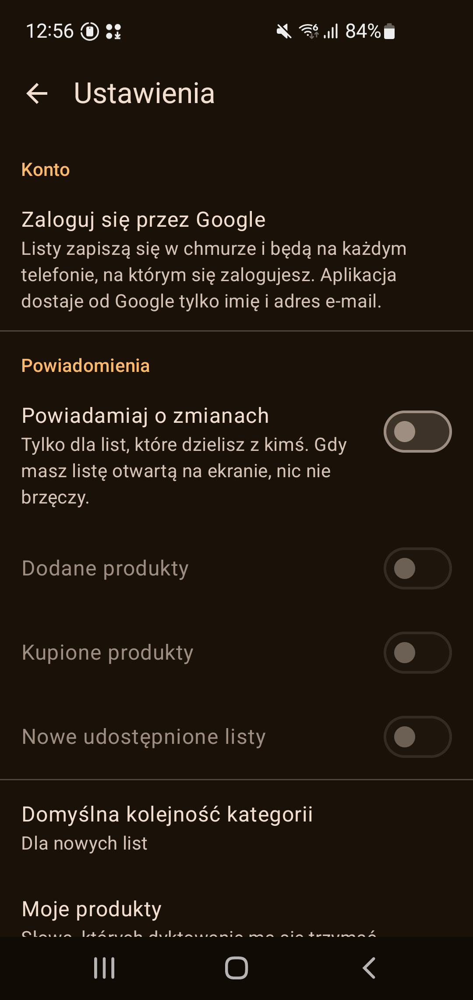

# Buy My Way 🛒

*Polish: „Kupuję po swojemu"*

A shared shopping list for Android. Keep any number of lists, private or shared with the people
you shop with; when one of you ticks something off at the shelf, the other sees it crossed out
within a second, and a closed app gets a notification. Items are grouped by the part of the shop
they are bought in, can carry a note and a photo, can be dictated or moved to another list, and a
whole week's list can be brought in from [Eat My Way](https://github.com/zyndata/eat-my-way) with
one share.

The interface is in **Polish**. The code, comments and documentation are in English.

## Screenshots

  
  
  
  
  

## Installing

Not on Google Play, and not planned to be. On the phone, open
[the newest release](https://github.com/zyndata/buy-my-way/releases/latest), download the
`.apk`, and let Android install it when it asks. That is the whole of it.

Every version is signed with the same key, so a later one installs straight over the one before
it and keeps your lists.

## Releases

Each release carries two files:

| File | What it is |
| --- | --- |
| `buy-my-way-vX.Y.Z.apk` | the app: signed, minified, about 3 MB, Android 8.0 and newer |
| `buy-my-way-vX.Y.Z.apk.sha256` | its checksum, if you want to check the download |

- **Every release:** [github.com/zyndata/buy-my-way/releases](https://github.com/zyndata/buy-my-way/releases)
- **What changed in each one:** [CHANGELOG.md](CHANGELOG.md), written from the commit messages.
- **The app tells you itself.** When you open Listy — at most once a day, in the foreground,
  never in the background — it asks GitHub whether there is a newer release and shows
  „Dostępna wersja X — Pobierz" if there is. Ustawienia → „O aplikacji" → „Sprawdź
  aktualizacje" asks straight away. Nothing about your account or your lists goes with that
  request.
- **`v1.0.0` is not tagged yet.** The app is feature-complete and the releases are real; the
  1.0 tag waits for a week of daily use with no open bug.

## What makes it different

- **Your lists are on your phone first.** The app works fully offline and without an account;
  until you sign in, no list leaves the device.
- **Shared lists live in a Firebase project, not on a server of ours.** When you sign in, your
  lists and their photos go to a Firebase Realtime Database that only the list's members can
  read, enforced by the database's rules. The app asks Google for your name and email and
  nothing else: no access to your Drive, your contacts or your location. The project's owner
  can limit sign-in to a private list of accounts; an account left off it is told so, keeps
  its lists on the phone, and can ask for access through this repository's issues.
- **Live, without draining the battery.** Another person's screen moves in under a second while
  the list is open. When the app is closed, a push message wakes it — no background service,
  no polling.
- **Nothing you did not ask for.** No premium tier, no ads, no leaflets, no price tracking, no
  analytics, no location or contacts permission.
- **Say it instead of typing it.** The mic reads one sentence as many items, with their
  quantities and departments, and always asks you to look before anything is added. It uses
  the recognizer that is already on the phone, offline where the Polish pack is installed; the
  app records nothing itself and keeps no audio. Words it does not know go in „Moje produkty",
  your own list, one tap at a time — never learned behind your back, so no typo of yours ever
  becomes a product.
- **Speaks Eat My Way.** Share a week's shopping list out of Eat My Way and it lands here in the
  right places, quantities and all: the nine departments of the shop are the same. Import the
  same list again and the quantities are summed, not doubled up. Any other text you share or
  paste becomes one item per line.

## Repository

- [PLAN.md](PLAN.md) — specification and phases
- [STATE.md](STATE.md) — progress, decisions, open questions
- [docs/DEVELOPMENT.md](docs/DEVELOPMENT.md) — local setup on Windows and Linux
- [docs/DEPLOYMENT.md](docs/DEPLOYMENT.md) — releases, Firebase, the push script
- [CHANGELOG.md](CHANGELOG.md) — generated from commit messages by git-cliff

## Licence

MIT — see [LICENSE](LICENSE). The icons in `app/src/main/res/drawable` (except the launcher
icon) are [Material Symbols](https://github.com/google/material-design-icons) by Google,
Apache License 2.0.
